## Universidad Politécnica Salesiana

## Practica :  Estructuras No Lineales "Arboles"

**Nombre:** Galo Prieto

**Fecha de entrega**: 22 de junio del 2026.

## Implementación de clases :

**Descripción:**

En esta práctica se realizó la creacion de varias clases cuyas condiciones fueron las necesarias para estructurar el funcionamiento correcto para los arlboles.

**Clase Persona:** Es el objeto que puede añadirse en los nodos, pero dependiendo del tipo de la clase node puede tener un promedio de datos primitivos, como a su vez objetos.

- Persona:

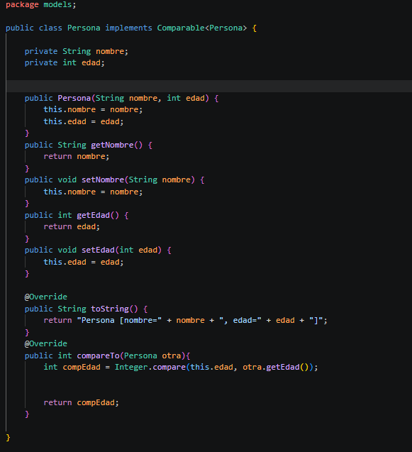

**AddRecursivo:** Se utilizó para la creación de arboles, además para restablecer valores que sean menores se ubiquen en la izquiera y valores que sean mayores en la derecha. 

- AddRecursivo:

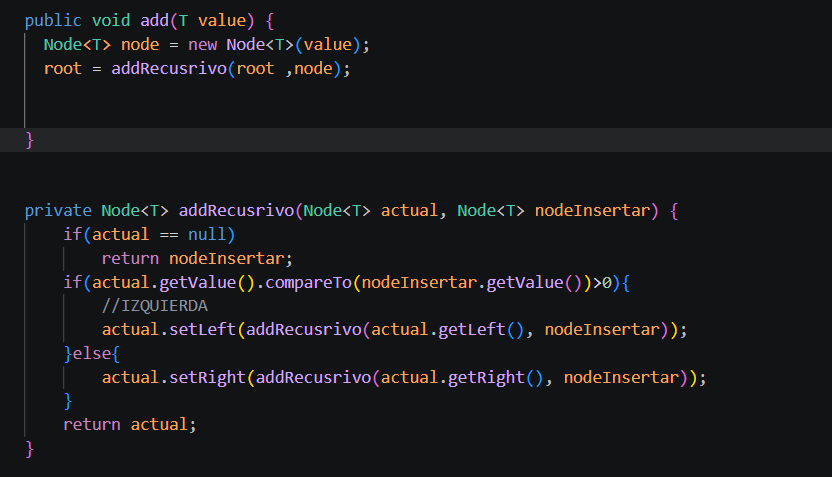

**Clase Node:** Se la implementó para verificar que datos la determinan y la forma en la que se estructuran para formar arboles. 

- Clase Node:

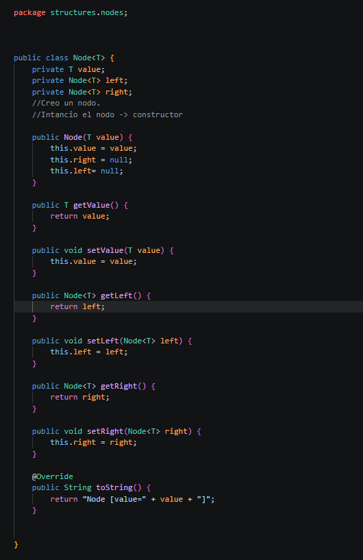

## Implementación de IntTree, utilizando métodos de ordenamiento: postOrden, intOrden ,preOrden.

**Clase IntTree:** Se implementó una clase IntTree, para almacenar valores enteros. Esta clase nos facilita en varias formas como es la agregacion de datos, y el recorrido de los datos mediante los métodos, como son: 

- Clase IntTree:

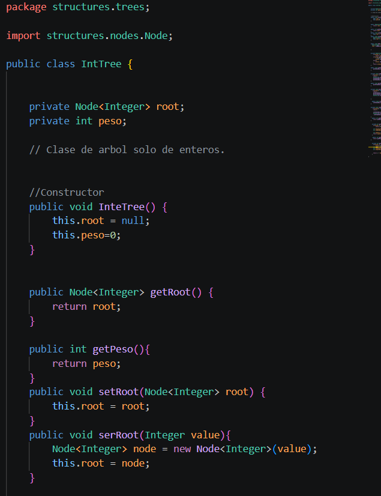

**PreOrden:** Tiene como estructura ordenar -> ("Raíz - Izquierda - Derecha").

**PostOrden:** Su estructura se base de la siguiente -> ("Izquierda - Derecha - Raíz").

**IntOrden:** Tiene como estructura -> (" Izquierda - Raíz - Derecha").

- Métodos: 

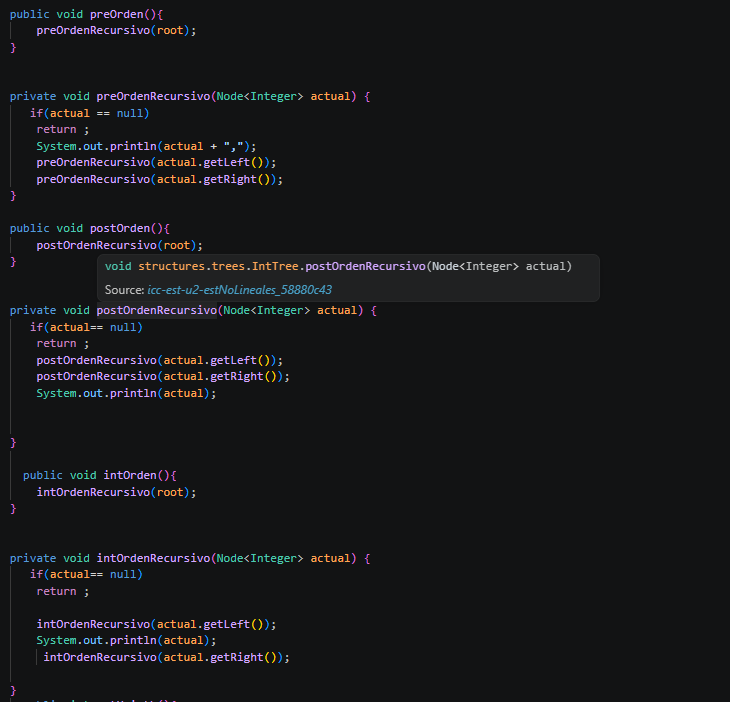

- Método de altura y peso:

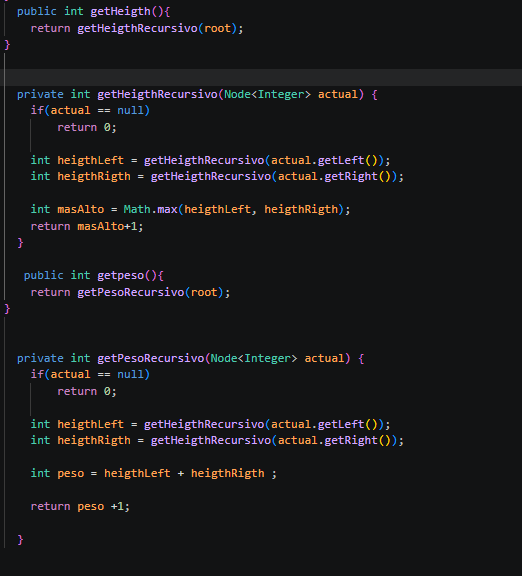

- Estructura para reducir el peso a O(1);

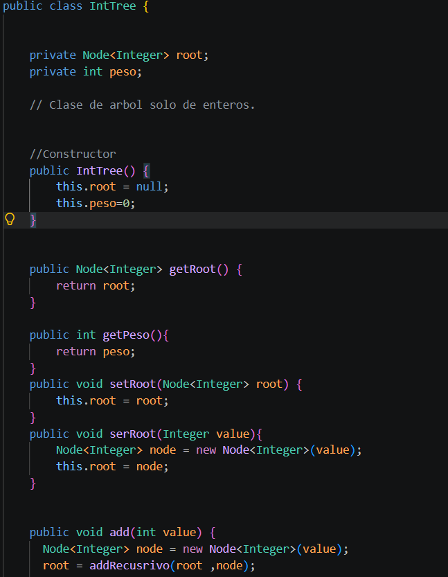

- Métodos del App:

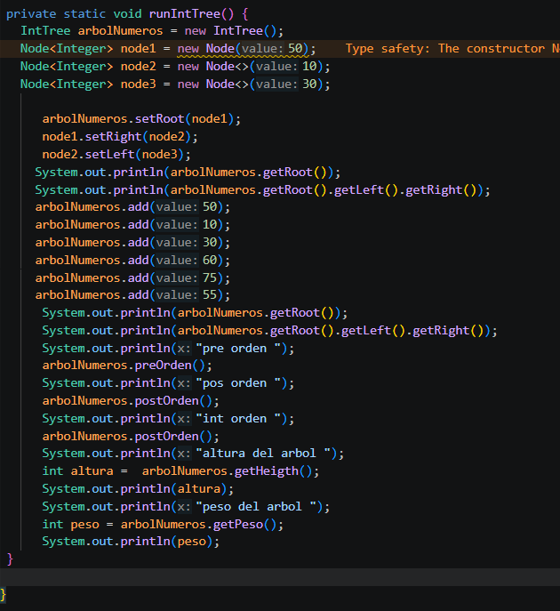

- Método de orden, altura y peso en consola: 

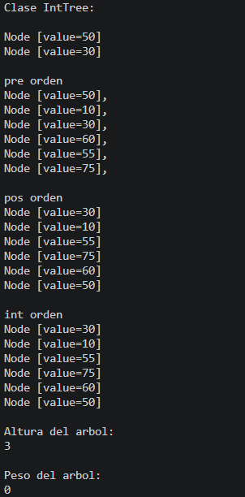

## Implementación de BinaryTree, utilizando métodos de ordenamiento: postOrden, intOrdne ,preOrden.

**Descripcion:**

La clase BinaryTree nos permitió guardar esos datos en un árbol binario usando nodos enlazados. Incluye los recorridos PreOrden, InOrden y PostOrden para visitar los nodos en diferentes órdenes. También permite insertar elementos y obtener información del árbol como su altura y la cantidad de nodos.

- Clase BinaryTree:

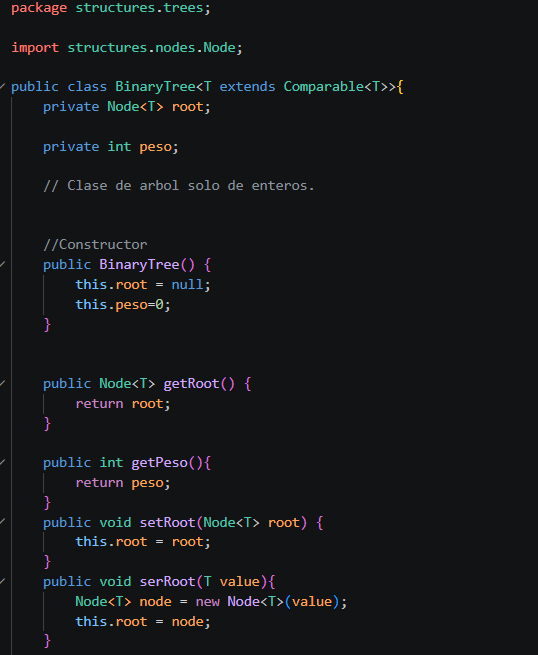

Esta clase, cumple el mismo trabajo que el anterior en sus metodos de orden, solamente que conlleva otro tipo de variable, pero su trabajo es igual. 

- Métodos de Orden: PreOrden, PostOrden, IntOrden: 

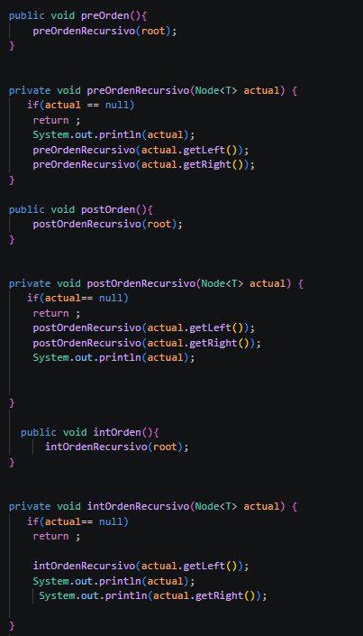

- Métodos de altura y peso: 

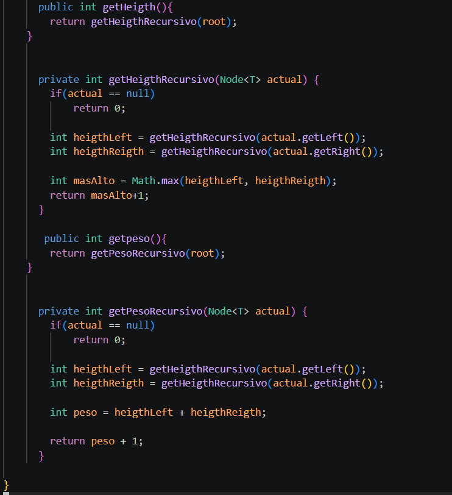

- App: 

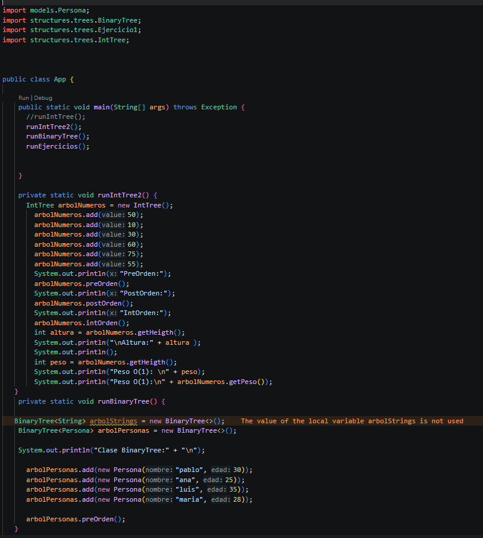

- Método de orden, altura y peso en consola: 

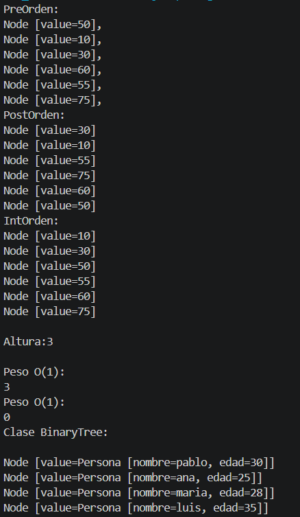
